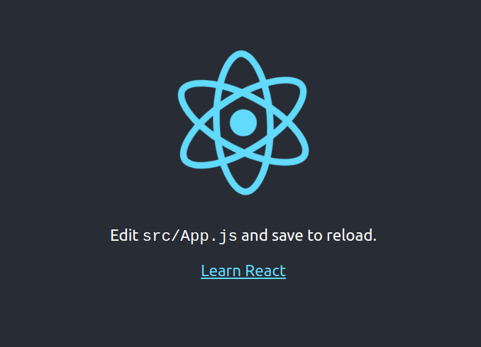
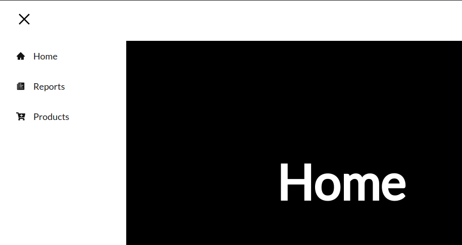
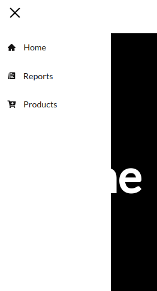

### Installing Node.js and npm using the NVM

1. Installing NVM (Node Version Manager) script

To download and install the nvm script run:

```
curl -o- https://raw.githubusercontent.com/nvm-sh/nvm/v0.35.3/install.sh | bash
```

The command above will clone the NVM repository from Github to the ~/.nvm directory.

2.  Update the system’s repository cache using the command given below

```
sudo apt update
```

Now, upgrade the installed packages as well, using the command provided below

```
sudo apt upgrade
```

3. Type the command given below to install the Curl on your system

```
sudo apt install curl
```

4. Restart your terminal

5. Verify it worked

```
nvm --version
```

6. See what it does

```
nvm ls-remote
```

7. Install the latest LTS release of Node.js and npm

```
nvm install --lts
```

8. Verify it worked, and that the version is correct

```
node --version
```

```
npm --version
```

### Installing Node.js and npm using the NVM

1. Setting up the project or local environment

```
mkdir web
```

```
cd web
```

2. Create a react boilerplate

```
npx create-react-app ./
```

- I am using ./ because I have created the folder and cd right into the directory
- ./ creates the react boilerplate for you right inside the created folder

3. install TailwindCSS

```
npm install react-loader-spinner --save and npm install react-router-dom@6
```

4. Start the application

```
npm run start
```



## Create a Sidebar Component in React

Next, we will create a collapsible sidebar navigation menu.

### Install the Necessary Modules

- npm i react-pro-sidebar react-icons

### Components

Create a folder named 'components' in 'src' and copy the contents of the files 'Navbar.js' and 'SidebarData.js' into your project.

'Navbar.js'

```
import React, { useState } from "react";
import * as FaIcons from "react-icons/fa";
import * as AiIcons from "react-icons/ai";
import { Link } from "react-router-dom";
import { SidebarData } from "./SidebarData";
import "../App.css";
import { IconContext } from "react-icons";

function Navbar() {
  const [sidebar, setSidebar] = useState(false);

  const showSidebar = () => setSidebar(!sidebar);

  return (
    <>
      <IconContext.Provider value={{ color: "undefined" }}>
        <div className="navbar">
          <Link to="#" className="menu-bars">
            <FaIcons.FaBars onClick={showSidebar} />
          </Link>
        </div>
        <nav className={sidebar ? "nav-menu active" : "nav-menu"}>
          <ul className="nav-menu-items" onClick={showSidebar}>
            <li className="navbar-toggle">
              <Link to="#" className="menu-bars">
                <AiIcons.AiOutlineClose />
              </Link>
            </li>
            {SidebarData.map((item, index) => {
              return (
                <li key={index} className={item.cName}>
                  <Link to={item.path}>
                    {item.icon}
                    <span>{item.title}</span>
                  </Link>
                </li>
              );
            })}
          </ul>
        </nav>
      </IconContext.Provider>
    </>
  );
}

export default Navbar;
```

'SidebarData.js'

```
import React from "react";
import * as FaIcons from "react-icons/fa";
import * as AiIcons from "react-icons/ai";
import * as IoIcons from "react-icons/io";

export const SidebarData = [
  {
    title: "Home",
    path: "/",
    icon: <AiIcons.AiFillHome />,
    cName: "nav-text",
  },
  {
    title: "Reports",
    path: "/reports",
    icon: <IoIcons.IoIosPaper />,
    cName: "nav-text",
  },
  {
    title: "Products",
    path: "/products",
    icon: <FaIcons.FaCartPlus />,
    cName: "nav-text",
  },
];
```

### Routes

Create a folder named 'routes' in 'src' and copy the contents of the files 'Home.js', 'Products.js', and 'Reports.js' into your project.

'Home.js'

```
import React from "react";

function Home() {
  return (
    <div className="home">
      <h1>Home</h1>
    </div>
  );
}

export default Home;
```

'Products.js'

```
import React from "react";

function Products() {
  return (
    <div className="products">
      <h1>Products</h1>
    </div>
  );
}

export default Products;
```

'Reports.js'

```
import React from "react";

function Reports() {
  return (
    <div className="reports">
      <h1>Reports</h1>
    </div>
  );
}

export default Reports;
```

### Styles

copy the contents of the file 'App.css' into your project file

'App.css'

```
@import url("https://fonts.googleapis.com/css2?family=Lato&display=swap");

* {
  box-sizing: border-box;
  margin: 0;
  padding: 0;
  font-family: "Lato", sans-serif;
}

.home,
.reports,
.products {
  display: flex;
  height: 90vh;
  align-items: center;
  justify-content: center;
  font-size: 3rem;
  background-color: #000;
  color: #fff;
}

/* Navbar CSS */
.navbar {
  background-color: #ffffff;
  height: 80px;
  display: flex;
  justify-content: flex-start;
  align-items: center;
}

.menu-bars {
  margin-left: 2rem;
  font-size: 2rem;
  background: none;
  color: #000;
}

.nav-menu {
  background-color: #ffffff;
  width: 250px;
  height: 100vh;
  display: flex;
  justify-content: center;
  position: fixed;
  top: 0;
  left: -100%;
  transition: 850ms;
}

.nav-menu.active {
  left: 0;
  transition: 450ms;
}

.nav-text {
  display: flex;
  justify-content: flex-start;
  align-items: center;
  padding: 8px 0px 8px 16px;
  list-style: none;
  height: 60px;
}

.nav-text a {
  text-decoration: none;
  color: #151414;
  font-size: 18px;
  width: 95%;
  height: 100%;
  display: flex;
  align-items: center;
  padding: 0 16px;
  border-radius: 4px;
}

.nav-text a:hover {
  background-color: #000000;
  color: #fff;
}

.nav-menu-items {
  width: 100%;
}

.navbar-toggle {
  background-color: #ffffff;
  width: 80%;
  height: 80px;
  display: flex;
  justify-content: flex-start;
  align-items: center;
}

span {
  margin-left: 16px;
} 
```

### Index

copy the contents of the file 'index.js' into your project file

```
import React from "react";
import { createRoot } from "react-dom/client";
import {
  createBrowserRouter,
  RouterProvider,
  Route,
  Outlet,
  createRoutesFromElements,
} from "react-router-dom";
import Products from "./routes/Products";
import Home from "./routes/Home";
import Reports from "./routes/Reports";
import Navbar from "./components/Navbar";
import "./App.css";

const AppLayout = () => (
  <>
    <Navbar />
    <Outlet />
  </>
);

const router = createBrowserRouter(
  createRoutesFromElements(
    <Route element={<AppLayout />}>
      <Route path="/" element={<Home />} />
      <Route path="/products" element={<Products />} />
      <Route path="/reports" element={<Reports />} />
    </Route>
  )
);

createRoot(document.getElementById("root")).render(
  <RouterProvider router={router} />
);
```

### Images






## Code Structure

## Run the Project

1. We need to specify version 22 of nvm

```
nvm use 22
```

2. Start the application

```
npm run start
```

If necessary, run the following command to install the dependencies:

```bash
npm install
```

```
npm install react-loader-spinner --save
npm install react-router-dom@6
```

## Contact

If you have any questions or suggestions, feel free to contact me via email.
